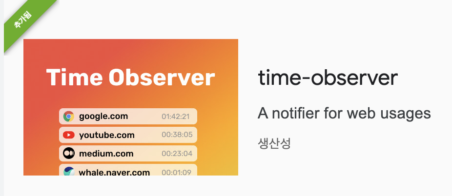

# time-observer

 

A simple Chrome extension that alerts you every hour and tracks the time you spend on each of Chrome's active tabs.

Available at [Chrome Web Store](https://chrome.google.com/webstore/detail/time-observer/pmjhjbicecnbnhnaaipggmodknhijmng)

> **Note**  
> We don't collect any single data from user's action. All data is stored in your Chrome's local storage.

 

## Features

### Daily and Weekly Logs

On the first time tab, it displays the list of the time spent on Chrome's active tabs for the last 7 days including today.

 

### Notification

On notification tab, You can see the notification list you've got for the last 7 days including today.

 

### Calendar

On the calendar tab, you can see each date's level for the past 100 days with Emoji calculated from the given base hours.

- `🫥` represents "No data exists" or "You've spent less than the base hour".

 

## License

[MIT](./LICENSE)
